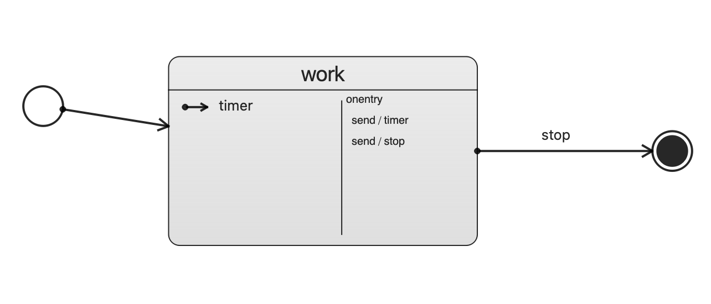

# DRAFT

### Chart
```erlang
-record(state, {id,
                initial,
                onentry = [],
                onexit = [],
                transition = [],
                state = [],
                final = false}).
                
-record(transition, {event, 'cond', target, type, execute = []}).

-record(send, {id, event, target, delay = 0}).

-record(log, {label}).

-record(raise, {event}).

-record(cancel, {sendid}).

-record(assign, {location, expr}).

-record(script, {content}).

-record('if', {'cond', then = [], 'else' = []}).

```

### Demo chart

```
scxml:load(File).
{ok,#state{
        id = "demo",initial = "work",onentry = [],onexit = [],
        transition = [],
        state =
            [#state{
                 id = "Final_2",initial = undefined,
                 onentry = [#log{label = "final log onentry"}],
                 onexit = [#log{label = "final log onexit"}],
                 transition = [],state = [],final = true},
             #state{
                 id = "work",initial = undefined,
                 onentry =
                     [#send{
                          id = "t1",event = "timer",target = undefined,delay = 1000},
                      #send{
                          id = "t2",event = "stop",target = undefined,delay = 3000}],
                 onexit = [],
                 transition =
                     [#transition{
                          event = "stop",'cond' = undefined,target = "Final_2",
                          type = "external",
                          execute = [#log{label = "transition log"}]},
                      #transition{
                          event = "timer",'cond' = undefined,target = undefined,
                          type = "internal",
                          execute =
                              [#log{label = "timer"},#send{id = undefined,...}]}],
                 state = [],final = false}],
        final = false}}
```

### Log
```
enter work
execute: {send,"t1","timer",undefined,1000}
execute: {send,"t2","stop",undefined,3000}
[work] timer event: timer
execute: {log,"timer"}
timer
execute: {send,undefined,"timer",undefined,1000}
[work] timer event: timer
execute: {log,"timer"}
timer
execute: {send,undefined,"timer",undefined,1000}
[work] timer event: stop
exit work
execute: {log,"transition log"}
transition log
enter Final_2
execute: {log,"final log onentry"}
final log onentry
exit Final_2
execute: {log,"final log onexit"}
final log onexit
terminated proc: demo
```
